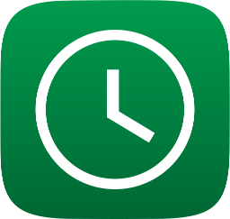

  
   
  <h1>What's Open for iOS</h1>
  

iOS client for SRCT's [What's Open API](https://api.srct.gmu.edu/WhatsOpen/v2/), designed for your iPhone and iPad and built with native Swift and UIKit.

On Contributing
---

Whats Open iOS  welcomes all the help it can get. Even if you don't feel like you can be helpful the more technical aspects, we definitely need designers, technical writers, and testers.

There are many things that can be done with this project (see the "To Do" section), but sometimes it's the small things that count, so don't be afraid of contributing just a small spelling mistake.

If you need help at all please contact and SRCT member. We want people to contribute, so if you are struggling, or just want to learn we are more than willing to help.

The project manager for this project is **Eyad Hasan**. *ehasan3@gmu.edu*

Please visit the [SRCT Wiki](http://wiki.srct.gmu.edu/) for more information on this and other SRCT projects, along with other helpful links and tutorials.

Setup
---

Requirements:

To get started, you'll need the following installed:
* [Git](http://git-scm.com/book/en/Getting-Started-Installing-Git)

* The latest **public** build of [Xcode](https://developer.apple.com/xcode/) (and a compatible Mac). *Currently Xcode 9* (You can get this from the [Mac App Store](https://itunes.apple.com/us/app/xcode/id497799835?mt=12) if you want easy updates)

* The latest **public** release of Swift. *Currently Swift 4.0* (bundled with Xcode)

* Cocoapods, for dependency management. You can install this by running `sudo gem install cocoapods` in your terminal. (Dependency management may change in the future)

Open a terminal window and type in the following commands. This will create a local, workable copy of the project.
  ``bash``  
  ``git clone [url]`` where the URL is the one listed at the top of the git repository for this project (preferrably using SSH)

**If there is not already a `Pods/` directory with contents**, install the needed dependencies by running
  ``pod install``
inside the the WhatsOpen directory.

To work on the project, you will need to **make sure to use the WhatsOpen.xcworkspace file**, and NOT the .xcodeproj file. This allows us to use the dependencies that you installed.

You may need to choose your personal development team inside of Xcode on the project settings page. If you are not a registered Apple developer, you can do so at [developer.apple.com](https://developer.apple.com/)

When Building and running, be sure to use the "WhatsOpen" scheme (you can see it to the right of the run and stop buttons) and NOT the "WhatsOpen - App Store" scheme. The second has special settings in the build process, as well as a registered bundle identifier, required for us to properly distribute the app ti the App Store.

**Important**: Only change information about signing on the traget named "WhatsOpen" and **not** the one labeled "WhatsOpen - AppStore" inside the Project infofmation section of Xcode.

What Won't Work During Development
---
- Crashlytics won't load in under the "WhatsOpen" Scheme. Use Xcode's debugger.
- Alternate app icons won't work (and will probably crash if you try to use them) due to the build method of adding them to the info.plist file. If you're an artist and have some cool alternate app icons to add, you can still do so in the `AlternateAppIcons.xcassets` file in the main project folder, and adding a cell for them in the SetIconTableViewController.

Troubleshooting
---
* If you recieve and error similar to ``ld: framework not found Pods
clang: error: linker command failed with exit code 1 (use -v to see invocation)`` then check to make sure you opened ``WhatsOpen.xcworkspace`` and not ``WhatsOpen.xcodeproj``

Distribution Information
---
To run a build for the App Store, you need the following
- Use the "WhatsOpen - App Store" scheme to build
- The bundle ID (edu.gmu.srct.whatsopen) registered to your Apple Developer account (requires Apple Developer Program membership) (Registered to Zach Knox)
- Certificates and Provisioning Profiles to build an app with the above bundle ID (currently held by Zach Knox and Eyad Hasan)
- a `crashlyticsbuild.sh` file with the Crashlytics run script in it inside the project folder.
- [alternate-icons](https://github.com/alexaubry/alternate-icons) installed to add the alternate icons to the bundle. (This build step is disabled during development builds because alternate icons are a trivial feature and dependencies are annoying).

To produce a `.ipa` for the App Store, run `Product > Archive`. When complete, you should see it in the Organizer. You can then upload using the organizer or export it with a distribution certificate and upload via Application Loader.

About GMU SRCT
---
**S**tudent - **R**un **C**omputing and **T**echnology (*SRCT*, pronounced "circuit") is a student organization at George Mason University which enhances student computing at Mason. SRCT establishes and maintains systems which provide specific services for Mason's community.
